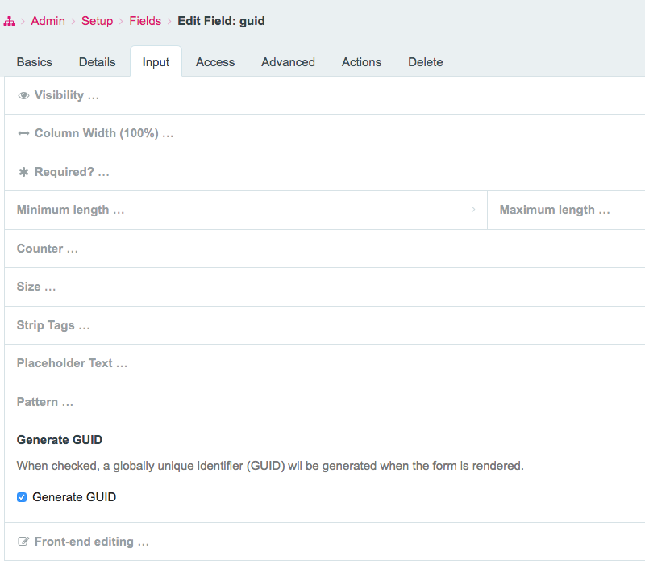
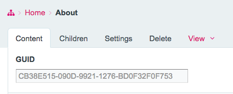

# WARNING: This repository is no longer maintained :warning:

> This repository will not be updated. The repository will be kept available in read-only mode.

# ProcessWire GUID Generator

**Designed for use with ProcessWire 3.x**

## About

Generate a globally unique identifier (GUID) for Inputfield **Text**.

## Usage

For each instance of a text field the field settings will be extended. Navigate to *Admin > Setup > Fields* and edit the desired field. Click on the Input Tab and click on the **"Generate GUID"** area.
It extends downwards and reveals a form to enable automatic GUID generation.

After having enabled GUID generation for a text field, edit a page which has a template containing this field.
You'll see the field filled with a GUID.

